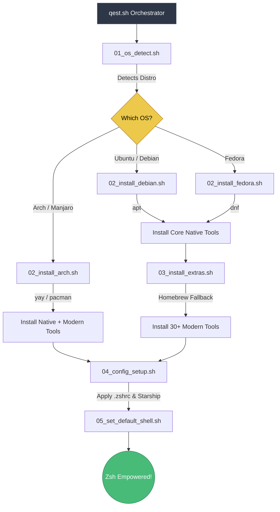

<div align="center">
  <h1>🚀 QEST</h1>
  <p><strong>Quite Effective Setup Tool</strong></p>
  <p>An automated, zero-friction, modular environment builder for modern Linux power users.</p>

  [](https://www.gnu.org/software/bash/)
  [](https://zsh.sourceforge.io/)
  [](https://opensource.org/licenses/MIT)
</div>

<br>

**QEST (Quite Effective Setup Tool)** is a cross-distribution modular setup script that provisions a fresh Linux installation with an ecosystem of over **40+ lightning-fast, modern, Rust and Go-based CLI tools**. 

It transforms standard `bash` environments into a beautiful, highly productive `zsh` ecosystem, replacing legacy commands with 21st-century counterparts (`eza`, `bat`, `fd`, `rg`, `zoxide`, `btop`) while gracefully handling package management across Debian/Ubuntu, Fedora, and Arch Linux.

---

## ✨ Features

- **🧠 Smart OS Detection**: Automatically adapts to Ubuntu, Debian, Fedora, Arch, and Manjaro, deploying the correct native package manager (`apt`, `dnf`, `pacman`).
- **📦 Mega Toolset Payload**: Installs 40+ next-generation tools including Zellij, Helix, Yazi, Atuin, Starship, Lazygit, and Lazydocker.
- **🍺 Homebrew & AUR Synergy**: Utilizes `yay` internally for Arch users to automatically provision the AUR, while providing a seamless `brew` fallback installer for Debian and Fedora edge-cases.
- **⚡ Supercharged Zsh**: Configures `.zshrc` out of the box with `zsh-autosuggestions`, `fzf-tab`, `fast-syntax-highlighting`, and the `Starship` prompt.
- **⚙️ Modern Aliasing**: Automatically proxies your muscle-memory default commands to their modern Rust variants (`ls` -> `eza`, `cat` -> `bat`, `find` -> `fd`, `cd` -> `zoxide`).
- **🛡️ Dry-Run Mode**: Test your deployments before changing state. Append `--dry-run` and QEST will beautifully simulate system mutations, `sudo` access, and Github clones safely.

---

## 🛠️ Included Arsenal

A subset of the tools QEST automatically provisions:

| Category | Tools Included |
|---|---|
| **Shell & Env** | `zsh`, `nushell`, `starship`, `direnv`, `atuin`, `chezmoi`, `age` |
| **Editors & Multiplexers** | `helix` (hx), `zellij` |
| **Git & Projects** | `lazygit`, `just`, `moulti` |
| **Monitors & Metrics** | `btop`, `bottom`, `viddy`, `sysz` |
| **Files & Navigation** | `yazi`, `eza`, `zoxide`, `fzf`, `fd`, `bat`, `delta`, `rclone`, `broot`, `s5cmd` |
| **Text & Data Processing** | `lnav`, `jq`, `yq`, `ripgrep`, `sd`, `jless`, `dasel`, `choose`, `visidata`, `logdy` |
| **Disk Operations** | `duf`, `procs`, `czkawka`, `dust`, `gdu`, `erdtree` |
| **Networking & Security** | `gping`, `doggo`, `xh`, `curl`, `wget`, `bandwhich`, `termshark`, `atac`, `gitleaks` |
| **Utilities** | `lazydocker`, `asciinema`, `tealdeer`, `navi`, `grex` |

---

## 🚀 Installation

QEST is designed to be interactive and heavily resilient. Do not clone it with `sudo`; the script elegantly elevates permissions on a per-command basis, protecting your home directory.

```bash
# 1. Clone the repository
git clone https://github.com/TinorNoah/QEST.git ~/.qest
cd ~/.qest

# 2. Make it executable
chmod +x qest.sh

# 3. (Optional) Run a dry-run to see exactly what will execute
./qest.sh --dry-run

# 4. Execute the setup
./qest.sh
```

### 🗂️ Architecture & Execution Flow

QEST is split into heavily scoped, `set -euo pipefail` hardened modules. Here is how the orchestrator gracefully routes the installation based on your distribution:



---

<div align="center">
  <i>Empower your terminal. Drop the legacy baggage.</i>
</div>
