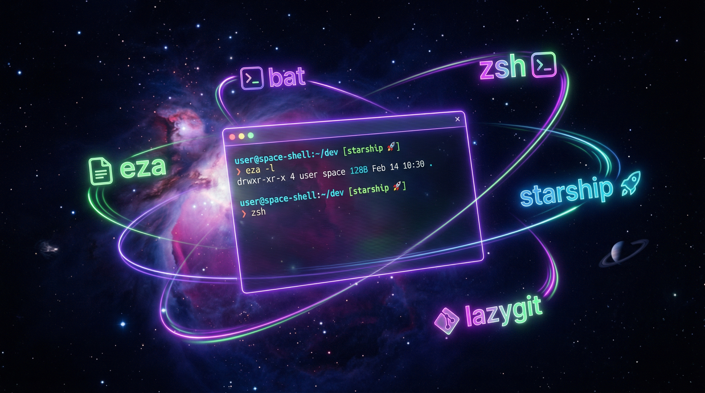

<div align="center">
  <h1>QEST</h1>
  <p><strong>Quite Effective Setup Tool</strong></p>
  <p>Single-command shell bootstrap with a full interactive terminal wizard.</p>
</div>

<br>



## What QEST is

QEST installs a modern shell environment on fresh Linux and macOS machines with one command:

```bash
curl -fsSL https://install.brainafk.in | bash
```

The bootstrap script stays tiny, downloads a prebuilt `qest` binary, verifies checksums, and runs the installer wizard.

## Architecture

1. **Bootstrap script**: [`get.qest.sh`](./get.qest.sh)
   - Detects distro + architecture.
   - Checks `curl`, `sudo`, internet access.
   - Downloads `qest-linux-amd64` or `qest-linux-arm64` from GitHub Releases.
   - Verifies SHA256 and executes the binary.
2. **Installer binary**: [`cmd/qest/main.go`](./cmd/qest/main.go)
   - Full-screen Bubble Tea wizard (TTY mode).
   - Plain fallback for `--no-gum` / non-TTY.
   - Phase-based install engine with per-tool source resolution.
3. **Tool catalog**: [`manifests/tools/`](./manifests/tools)
   - One TOML file per tool.
   - Encodes category, tier, install source per OS, package mapping, validation state.
4. **Cloudflare Worker**: [`cloudflare-worker/src/index.js`](./cloudflare-worker/src/index.js)
   - Serves the latest bootstrap script from GitHub.
   - Returns actionable fallback command if upstream fetch fails.

## First run expectations

When you run `curl -fsSL https://install.brainafk.in | bash`, QEST does this in order:

1. bootstrap checks supported OS, CPU architecture, `curl`, `sudo`, internet, and checksum tools
2. bootstrap downloads release binary + `.sha256`, verifies checksum, then starts `qest`
3. `qest` loads tool manifests from `manifests/tools` and runs wizard/interactive selection
4. installer executes phases with per-phase status, then prints success/failure summary

For local development runs, execute from the repo root so `manifests/tools` is discoverable.

## Current support

- **OS**: Ubuntu/Debian, Fedora, Arch/Manjaro, macOS
- **CPU**: amd64, arm64
- **Modes**:
  - Interactive TTY -> full-screen wizard
  - `--yes` -> non-interactive install with defaults
  - `--dry-run` -> preview commands
  - `--no-gum` -> plain sequential mode

## v0.1 validated default set

QEST currently defaults to a small cross-OS validated set:

- shell/core: `zsh`, `starship`, `zsh-autosuggestions`, `fzf`, `zoxide`
- essentials: `bat`, `ripgrep`, `fd`, `jq`, `btop`, `eza`, `git-delta`
- editor/workflow: `helix`, `zellij`, `lazygit`
- config: bundled `.zshrc` + `starship.toml` with backup/restore

Verification gate:

- [`tests/verify.sh`](./tests/verify.sh) validates v0.1 tooling/config presence.

## Tool source strategy

Each tool is resolved per OS using a source policy from TOML manifests:

- `native` -> apt/dnf/pacman
- `brew` -> Homebrew fallback (primarily Ubuntu/Fedora for missing packages)
- `unsupported` -> omitted from current install plan and marked for future rollout

## Run locally from repo

```bash
# interactive
go run ./cmd/qest

# non-interactive defaults
go run ./cmd/qest --yes --no-gum

# dry-run
go run ./cmd/qest --dry-run --yes --no-gum
```

## CI and release

- CI: [`.github/workflows/ci.yml`](./.github/workflows/ci.yml)
  - ShellCheck for bootstrap/scripts
  - `go build` and `go test`
  - Docker matrix smoke checks
- Tagged release: [`.github/workflows/release.yml`](./.github/workflows/release.yml)
  - static binaries (`CGO_ENABLED=0`) for linux/darwin amd64 and arm64
  - checksum files
  - release assets:
    - `qest-linux-amd64`
    - `qest-linux-amd64.sha256`
    - `qest-linux-arm64`
    - `qest-linux-arm64.sha256`
    - `qest-darwin-amd64`
    - `qest-darwin-amd64.sha256`
    - `qest-darwin-arm64`
    - `qest-darwin-arm64.sha256`

## Implementation status

| Area | Status | Notes |
| --- | --- | --- |
| Bootstrap downloader + checksum verify | Implemented | [`get.qest.sh`](./get.qest.sh) |
| Cloudflare bootstrap route + fallback messaging | Implemented | `install.brainafk.in` worker path |
| Full-screen wizard + plain fallback + `--yes` | Implemented | [`cmd/qest/main.go`](./cmd/qest/main.go) |
| Phase-based installer with per-phase failure isolation | Implemented | tools, shell plugins, config, default shell |
| TOML tool catalog (one file per tool) | Implemented | [`manifests/tools/`](./manifests/tools) |
| Manifest validation gate in CI | Implemented | `go run ./cmd/qest --validate-manifests` |
| v0.1 verification gate in Docker matrix | Implemented | [`tests/verify.sh`](./tests/verify.sh), [`test_docker.sh`](./test_docker.sh) |
| v0.2 extended optional tool batch rollout | Planned | see [`ROADMAP.md`](./ROADMAP.md) |
| v0.3 advanced/experimental staged rollout | Planned | see [`ROADMAP.md`](./ROADMAP.md) |

## v0.1 release checklist

- bootstrap + worker serve latest script and fallback command
- release pipeline publishes linux amd64/arm64 binaries + checksum files
- manifests pass structural validation in CI
- `tests/verify.sh` passes on Ubuntu, Fedora, and Arch Docker containers
- docs and tracker issue are updated for release state

## Planned next (v0.x roadmap)

See full plan in [`ROADMAP.md`](./ROADMAP.md) for concrete `v0.1`, `v0.2`, `v0.3` tool batches and promotion gates.

Track progress:

- [v0.1 milestone](https://github.com/TinorNoah/QEST/milestone/1)
- [v0.1 release tracker](https://github.com/TinorNoah/QEST/issues/9)

## Troubleshooting

- If `install.brainafk.in` fails temporarily:
  - use direct fallback:
  ```bash
  curl -fsSL https://raw.githubusercontent.com/TinorNoah/QEST/main/get.qest.sh | bash
  ```
- If `sudo` prompts fail:
  ```bash
  sudo -v
  ```
- For plain mode in constrained terminals:
  ```bash
  go run ./cmd/qest --no-gum
  ```

## Wiki

Extended implementation notes and operational docs live in the project wiki:

- [QEST Wiki Home](https://github.com/TinorNoah/QEST/wiki)
